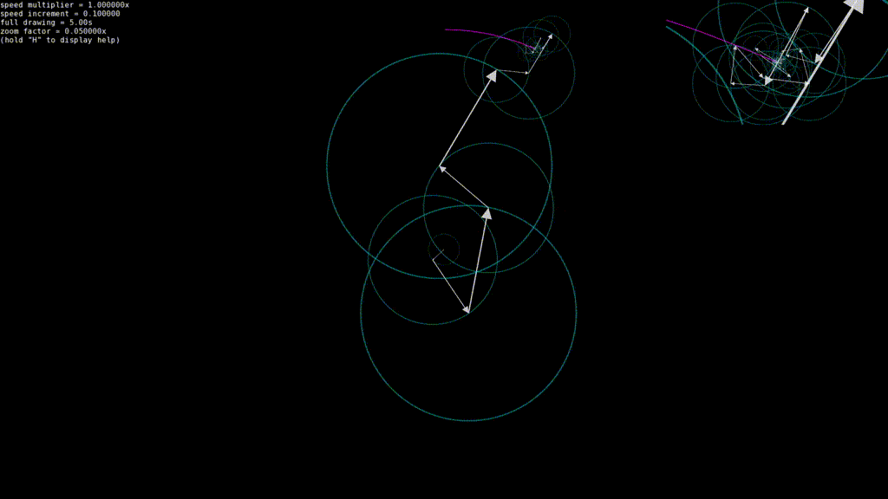

# FSDraw (Fourier Series Draw)

This project is inspired from [3blue1brown's video](https://www.youtube.com/watch?v=r6sGWTCMz2k) on fourier series.
This is my implementation of the animation in which a svg path is drawn with a chain of rotating circles with arrows
of various sizes. This is a way to visualize how Fourier series actually work.

## Example
### Gif of the GitHub logo being drawn


## Build (Linux)

### Requirement
- cmake
- sfml

### Compile & Run
```shell
# From the project root
mkdir build && cd build
cmake .. -DCMAKE_BUILD_TYPE=Release
make -j4
./fsdraw
```

## Windows
Download the last release binary.

## Features
- Zoom view on drawing tip (changeable)
- Changeable speed of drawing
- Multiple key actions (press "H" while running to see them all)

## How to change the path being drawn?
This project does not yet support direct importation of SVG files. To change the path being drawn,
edit `./src/main.cc` and at the line 5 "`e.run("github", 200, 1, 5);`" replace `github` by the name
of any of the files in `./res/paths`. 

You can also add your own `.txt` path file. You just need to put a list of XY coordinates and put the number
of points at the top. For example:
```text
3
1.4 2.2
1.7 2.1
1.4 1.9
```
Do not worry about the scale of these coordinates, the points are automatically adjusted to fit the screen.